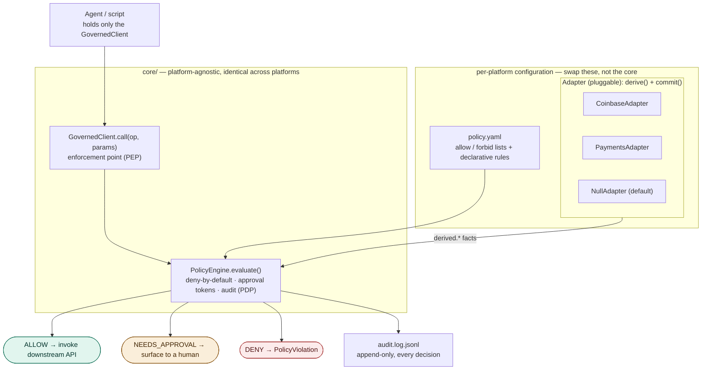

# Calero — a platform-agnostic policy-as-code governance layer for agents

Calero sits between an autonomous agent (or any automated script) and the API it acts on, and guarantees the agent can only do what a human has explicitly permitted — no matter what the agent decides to attempt. The rules live in a plain-text policy file rather than being scattered through application code, which is what "policy as code" means: the policy is versionable, reviewable, testable, and changeable without touching program logic.

The layer is **platform-agnostic**. The engine that judges requests holds no knowledge of any particular API; it evaluates declarative rules against a context document and returns ALLOW / DENY / NEEDS_APPROVAL. Everything specific to a platform — which operations exist, and how to compute the facts a policy's rules reference — is supplied by a small **adapter**. This repo ships two adapters (Coinbase and a Stripe/bank-style payments API) running on one unchanged core, which is what makes "platform-agnostic" a demonstration rather than a claim.

The design follows three principles. **Deny by default:** any operation not explicitly allowed is blocked, and a rule that cannot be evaluated (missing field, unknown operator) counts as failed. **Structural enforcement:** the agent is never given the raw client or its credentials, only a wrapper that routes every call through the policy engine, so bypassing governance is not merely forbidden but impossible from the agent's position. **Total auditability:** every request, allowed or denied, is written to an append-only log with a timestamp, the parameters, the verdict, the reason, and the ids of any rules that failed.

## Architecture: core + adapters

```
core/                     the platform-agnostic governance layer
  policy_engine.py        the judge (Policy Decision Point) — no domain code
  governed_client.py      the enforcement point — wraps ANY downstream client
  adapter.py              the Adapter contract + the default NullAdapter
adapters/
  common.py               shared derivation helpers (parse_money, DailyAccumulator)
  coinbase/               reference adapter: crypto trading (create_order)
  payments/               second adapter: Stripe/bank-style payouts
alice-bob/                companion demo: two agents talk, the engine judges intent
treasury-desk/            executable multi-agent testbed: two agents move real
                          (mock-ledger) funds; invariants prove nothing leaked
```



Reading the map: the agent holds only the `GovernedClient`, so every action must pass through `PolicyEngine.evaluate()` — bypassing governance is structurally impossible. The two boxes in `core/` never change; a new platform swaps in its own `policy.yaml` and `Adapter`, which is the only place `derived.*` facts (parsed amounts, running daily totals) come from. The default `NullAdapter` supplies none, so the core runs standalone on params-only policies. Only an `ALLOW` reaches the downstream API; every verdict is appended to the audit log.

**The core** knows how to run declarative rules (`field` / `op` / `value`) against a context document of `params.*` (the request as submitted) and `derived.*` (facts computed for the request), enforce deny-by-default with a forbidden list that beats the allowed list, apply platform controls (kill switch, rate limit, active hours), verify HMAC human-approval tokens, and audit every decision. None of that is platform-specific.

**An adapter** supplies the one piece of domain knowledge the core lacks: the `derived.*` facts a policy's rules reference, plus any running accumulators (daily spend, counts). The contract is two methods — `derive(request)` (side-effect free; computes the facts) and `commit(request, context)` (called only after an ALLOW; advances the accumulators, so denied attempts never consume budget). See `core/adapter.py`.

The default **`NullAdapter`** supplies no derived facts. Paired with a params-only policy, the core alone is already a working governance layer — operation allowlists, forbidden operations, rate limits, and an approval gate over named operations — with zero domain code. Adapters exist only to add `derived.*` facts on top.

## Configuration as code vs policy as code

An earlier version of this project kept the rule *logic* in Python and only the *numbers* (caps, allowlists) in YAML. That is configuration as code — useful, but changing what kinds of rules exist still meant editing the engine. This version moves the business rules themselves into the policy file as declarative data (a field, an operator, a value, and a consequence), evaluated generically. Adding a brand-new guardrail — say, a per-product daily cap — is now a policy-file edit plus a test, no engine change. That is the maturity step the industry-standard tools (OPA, Cedar) institutionalize; see `adapters/coinbase/rego/` for the Coinbase policy expressed in OPA's Rego language.

Two layers live in every policy file, and the distinction is deliberate:

- **Platform controls** — kill switch, master enable, operation allowlist/forbidden list, rate limit, active hours. These guard the pipeline itself and are implemented in the core, parameterized by the policy.
- **Business rules** (`rules:`) — the declarative field/op/value checks that judge each request against the `params.*` + `derived.*` context. Each rule fails to either `deny` or `needs_approval`; deny always outranks approval.

## The adapters

### `adapters/coinbase/` — the reference adapter

A governance layer for a Coinbase trading agent: a product allowlist (BTC-USD / ETH-USD), a buy-only constraint, per-order and rolling daily dollar caps, a daily order-count cap, permanently forbidden withdrawals and on-chain sends, and a threshold above which a human must approve each order. Has its own README, policy, runnable demo, and an OPA/Rego port of the rules. See [adapters/coinbase/README.md](adapters/coinbase/README.md).

### `adapters/payments/` — a second platform, same core

A Stripe/bank-style payouts agent: a recipient allowlist, per-payout and daily caps, a per-refund cap, forbidden raw transfers, and an approval threshold. Amounts arrive in **cents** while the policy is written in dollars — a deliberately different param shape from Coinbase's dollar `quote_size` — showing the adapter, not the core, owns unit handling. See [adapters/payments/README.md](adapters/payments/README.md).

## Demos & testbeds

Two runnable scenarios show the core governing live agents, at opposite ends of the "does anything execute?" spectrum:

- **`alice-bob/` — judgment.** Two Claude personas converse about money; each intent they voice is judged live by the engine, but nothing executes. It shows the layer *deciding*. See [alice-bob/README.md](alice-bob/README.md).
- **`treasury-desk/` — enforcement.** Two governed agents — **Catherine (Treasury)** funds **David (Fund Manager)**, who invests via a market venue and returns capital — move real balances on a mock ledger. An `ALLOW` mutates the ledger; a battery of adversarial attempts (exfiltration to a stranger, over-cap sends, forbidden ops) is measured pass/fail; and post-run **invariants** prove no funds ever reached an unauthorized counterparty. This is the first scenario to model *agent-to-agent authorization* — David may transact with no one but Catherine, enforced both structurally and by a counterparty-allowlist rule that rides the engine's existing `in` operator with **no core change**. See [treasury-desk/README.md](treasury-desk/README.md).

## The core files

### core/policy_engine.py

The judge (the Policy Decision Point). It loads a policy and exposes `evaluate(request)`, which builds a context document via the adapter, runs every applicable rule against it, and returns ALLOW, DENY, or NEEDS_APPROVAL with a human-readable reason and the failed rule ids. Platform controls run first (kill switch, enable flag, forbidden list beating the allowed list, deny-by-default allowlist, active hours, rate limit), then the declarative business rules.

The engine also implements the human-approval mechanism. When a request trips a `needs_approval` rule, it halts with NEEDS_APPROVAL. A human then runs `mint_approval_token(operation, params)` out-of-band, producing a token of the form `nonce.expiry.signature`, HMAC-signed over the exact operation, parameters, nonce, and expiry using a secret the agent does not know (`AGENT_APPROVAL_SECRET`). The token is valid only for that precise request (change any parameter and the signature no longer matches), expires after a TTL (default 15 minutes), and is single-use — the engine records the nonce when the approved request executes and denies any replay.

### core/adapter.py

The Adapter contract (`derive` + `commit`) and the `NullAdapter`. Adapters own their accumulator state; the engine owns only generic platform-control state (rate-limit timestamps, consumed approval nonces). `derive`/`commit` run under the engine's lock, so an adapter instance belongs to a single engine.

### core/governed_client.py

The enforcement point (the Policy Enforcement Point). `GovernedClient` wraps the real downstream client and is the only object the agent is ever handed. Its single method, `call(operation, params, approval_token)`, submits the request to the engine and only invokes the underlying client method if the verdict is ALLOW. A DENY raises `PolicyViolation`; a NEEDS_APPROVAL raises `ApprovalRequired`, which the surrounding application should surface to a human. Because the raw client and its credentials never enter the agent's context, there is no code path from the agent to the API that skips the policy check.

### SECURITY_PRIMER.md

A use-case-agnostic security primer for agent governance layers: the threat model (malfunctioning agents, prompt injection, replay, restart attacks, operator error), the core principles (structural enforcement, fail-closed evaluation, blast-radius limits, approval integrity, auditability, kill switches), a table mapping attacks to controls, and a review checklist. The adapters in this repo are the running examples; the document stands alone.

### tests/

`test_core.py` exercises the platform-agnostic core with the `NullAdapter` and a params-only policy (platform controls, the full approval-token lifecycle, fail-closed behavior). `test_coinbase_adapter.py` and `test_payments_adapter.py` exercise each adapter's business rules and derived facts against the real engine. In a real deployment this runs in CI, so a policy edit that accidentally weakens a guardrail fails the build before it reaches the agent.

## Running it

```sh
python3 -m venv .venv
.venv/bin/pip install -r requirements.txt   # pyyaml, pytest

.venv/bin/python -m adapters.coinbase.demo  # the Coinbase scenarios
.venv/bin/python -m adapters.payments.demo  # the payments scenarios
.venv/bin/python -m pytest tests/ -v        # all three suites
```

To wire an adapter to a real API, construct the vendor's client, build a `PolicyEngine(policy_path, adapter=TheAdapter())`, and hand a `GovernedClient(vendor_client, engine)` to the agent. Everything else stays the same.

## Adding a new platform

1. Write `adapters/<name>/adapter.py` with `derive`/`commit` (reuse `adapters/common.py` for money parsing and daily totals).
2. Write `adapters/<name>/policy.yaml` — the operation allow/forbid lists and the business rules over `params.*` / `derived.*`.
3. Add `adapters/<name>/demo.py` and `tests/test_<name>_adapter.py`.

The core does not change.

## Defense-in-depth, not a replacement for API scopes

This layer complements, not replaces, the permissions the API itself enforces. The key's scope, enforced by the vendor's servers, is the outer wall: a read-only key cannot trade no matter what any local code says. Calero adds the fine-grained rules the vendor cannot express — dollar caps, allowlists, approval workflows, trading hours — plus a complete audit trail. Use the narrowest key scope the agent's job requires, this policy layer on top, and never grant transfer or withdrawal permission on the key at all.

## Limitations worth knowing

Daily accumulators and the consumed-nonce set for approval tokens are held in memory, so they reset if the process restarts; a production deployment should persist them (a restart currently re-opens the replay window for unexpired tokens). The engine trusts the parameters it is shown, so the `GovernedClient` wrapper must remain the sole gateway to the client. The policy file must be protected — if the agent can edit it, governance is decorative — so make it read-only to the agent process and owned by a different user. Smaller items: the active-hours window does not support ranges that wrap past midnight UTC; requests denied by business rules still consume a rate-limit slot; and audit entries are plain JSONL without hash chaining, so log tampering is detectable only by external means (ship them off-host).
