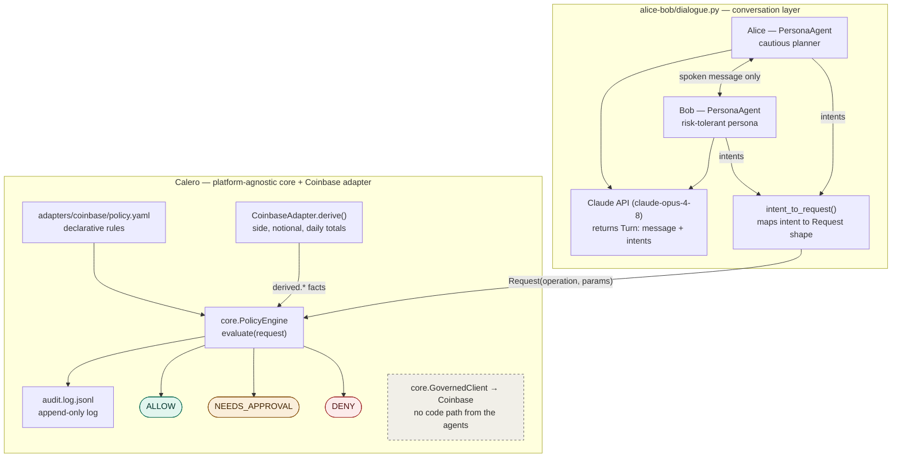

# Alice & Bob: Two Agents Talking About Money, Judged by Policy

A companion learning project to the Calero governance layer. Two Claude-backed personas — cautious Alice and risk-tolerant Bob — hold a fixed-length conversation about checking accounts, savings, and stock investments, the way two friends would over coffee. Every money movement they *propose* is judged live by the parent project's `PolicyEngine`; nothing they say can ever *execute* anything.

## What it demonstrates

**Agents that can only talk.** Neither persona is given any tools, API access, or connection to a bank or brokerage. Each agent's entire input is the other agent's last message; each agent's entire output is its next reply. There is no code path from either agent to any financial system — the same structural-enforcement idea as the parent project's `GovernedClient`, applied at the conversation level.

**The governance layer as the judge of intent.** Alongside its spoken reply, each persona emits structured *intents*: money movements it says it wants to make. `intent_to_request()` maps each intent to the `Request(operation, params)` shape the parent `PolicyEngine.evaluate()` consumes, and the engine judges it against the parent's `policy.yaml` in real time:

```
Bob: Honestly, I've been eyeing NVDA — I think I'll put $500 in this week.
  ↳ intent: buy $500 NVDA → create_order {'product_id': 'NVDA', 'side': 'BUY', 'quote_size': '500'}
    ⛔ PolicyEngine: DENY — rule 'allowed-products' failed: Only trade approved pairs (judged only; nothing executes)

Bob: Maybe I'll just drop $5 into bitcoin instead.
  ↳ intent: buy $5 BTC → create_order {'product_id': 'BTC-USD', 'side': 'BUY', 'quote_size': '5'}
    ✅ PolicyEngine: ALLOW — all checks passed (judged only; nothing executes)
```

The conversation naturally exercises the policy's controls:

| Conversational intent | Mapped request | Typical verdict |
|---|---|---|
| "Buy $500 of NVDA" | `create_order` NVDA | ⛔ DENY — product allowlist (BTC-USD/ETH-USD only) |
| "Move $500 checking → savings" | `create_transfer` | ⛔ DENY — forbidden operation (beats everything) |
| "Put $5 into bitcoin" | `create_order` BTC-USD | ✅ ALLOW — within all caps |
| "Put $15 into bitcoin" | `create_order` BTC-USD | ✋ NEEDS_APPROVAL — above the $10 human-approval threshold |
| "Where do I stand?" | `get_accounts` | ✅ ALLOW |

Even an ALLOW executes nothing — there is no client behind the engine here. Every judgment is appended to the parent's `audit.log.jsonl`, so a full run leaves the same audit trail a governed production agent would. (The engine is loaded with the active-hours rule dropped in memory, as in the parent's `demo.py`, so the demo runs at any hour; `policy.yaml` is untouched.)

## Architecture



Reading the map: only spoken text crosses between the personas — the structured internals stay private to each side. Intents funnel through `intent_to_request()` into the governance layer, where the platform-agnostic `core.PolicyEngine` judges them against `adapters/coinbase/policy.yaml`, drawing the `derived.*` facts (order side, notional, running daily totals) from the `CoinbaseAdapter`, and logs every decision. The dashed `core.GovernedClient → Coinbase` box is the execution path from the root project, and nothing connects to it — even an `ALLOW` verdict only gets printed. Wiring allowed intents into `GovernedClient.call()` is the intended next step of the learning progression.

## Running it

```sh
python3 -m venv .venv
.venv/bin/pip install -r requirements.txt

# Needs credentials: export ANTHROPIC_API_KEY=... (or `ant auth login`)
.venv/bin/python dialogue.py               # 6 exchanges
.venv/bin/python dialogue.py --turns 2     # shorter run
.venv/bin/python dialogue.py --opener "Debate whether to pay down the mortgage or invest."

.venv/bin/python -m pytest tests/ -v       # offline tests, no API calls
```

The tests need no API key: they cover the intent→request mapping and feed mapped intents through the real `PolicyEngine` against the real `policy.yaml`, asserting the verdicts in the table above.

## How it works

- `PersonaAgent` holds one persona's system prompt and conversation history. `respond()` sends the history to the Claude API with a structured-output schema (`Turn`), so every reply comes back as `{message, intents}` — validated, with a retry on the occasional malformed generation.
- Only the `message` text crosses between agents; the structured internals stay private to each side, just as one human can't see another's thoughts.
- `load_policy_engine()` imports `policy_engine.py` from the parent directory and loads the parent `policy.yaml`. If the subproject is run outside the Calero repo, intents are printed unjudged and the script says so.
- The conversation runs a fixed number of exchanges (`--turns`), alternating Alice → Bob, seeded by an opener prompt handed to Alice.
